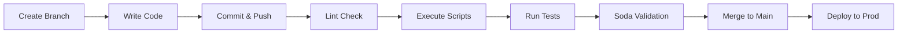

# Conveyor CI/CD Pipeline

Pipeline completo de CI/CD para despliegues de SQL y Python/PySpark en Databricks con validación estática, ejecución de tests y verificación post-despliegue con Soda Core.

## Características

- ✅ Análisis estático de código SQL (SQLFluff)
- ✅ Análisis estático de código Python (Pylint, Black, Flake8)
- ✅ Ejecución de scripts SQL en Databricks
- ✅ Validación de notebooks PySpark
- ✅ Tests post-despliegue con Soda Core
- ✅ Gestión automática de tokens temporales
- ✅ Soporte para GitHub Actions y Azure DevOps
- ✅ Configuración por entorno (dev/staging/prod)

## 📁 Estructura del Proyecto

```
databricks-cicd/
├── .github/workflows/          # GitHub Actions workflows
├── azure-pipelines/            # Azure DevOps pipelines
├── scripts/
│   ├── sql/                   # Scripts SQL
│   └── python/                # Scripts Python/PySpark
├── tests/
│   ├── unit/                  # Tests unitarios
│   └── integration/           # Tests de integración
├── soda/                       # Data quality checks (Soda Core)
│   ├── configuration.yml      # Conexión a Databricks
│   └── checks/                # Checks por tabla
├── deployment/                 # Scripts de deployment
├── config/                     # Configuración por entorno
└── docs/                       # Documentación
```

## 🛠️ Setup Local

### 1. Clonar el repositorio

```bash
git clone <tu-repo>
cd conveyor
```

### 2. Configurar entorno Python

```bash
python -m venv venv
source venv/bin/activate  # En Windows: venv\Scripts\activate
pip install -r requirements.txt
```

### 3. Configurar Databricks CLI

```bash
databricks configure --token
# Host: https://dbc-xxxxx.cloud.databricks.com
# Token: <tu-token>
```

O editar `~/.databrickscfg`:

```ini
[dev]
host = https://dbc-xxxxx.cloud.databricks.com
token = dapi123456789
```

### 4. Configurar variables de entorno

Copiar `.env.example` a `.env` y configurar:

```bash
cp .env.example .env
```

Editar `.env`:

```
DATABRICKS_PROFILE=dev
WAREHOUSE_ID=abc123def456
CATALOG=main
SCHEMA=default
```

## 🔍 Validación Local

### SQL

```bash
# Lint SQL
sqlfluff lint scripts/sql/

# Fix SQL
sqlfluff fix scripts/sql/
```

### Python

```bash
# Lint Python
pylint scripts/python/

# Format Python
black scripts/python/

# Type checking
mypy scripts/python/
```

### Ejecutar tests

```bash
# Tests unitarios
pytest tests/unit/ -v

# Tests de integración
pytest tests/integration/ -v

# Soda Core
soda scan -d databricks -c soda/configuration.yml soda/checks/
```

## 🚢 Deployment

### GitHub Actions

1. Configurar secrets en GitHub:
   - `DATABRICKS_HOST`
   - `DATABRICKS_TOKEN`
   - `WAREHOUSE_ID`

2. Push a una rama:
   ```bash
   git checkout -b feature/new-pipeline
   git add .
   git commit -m "Add new data pipeline"
   git push origin feature/new-pipeline
   ```

3. Crear Pull Request
4. El pipeline se ejecutará automáticamente

### Azure DevOps

1. Configurar Service Connection para Databricks
2. Configurar variables en Pipeline:
   - `databricks.host`
   - `databricks.token`
   - `warehouse.id`

3. Push trigger automático

## 📊 Workflow



## 🔒 Seguridad

- Los tokens de Databricks se generan temporalmente para cada ejecución
- Se eliminan automáticamente después de la ejecución
- Nomenclatura: `sqlops_temp_IOPXXXXXX`
- Duración: 2 horas (configurable)

## 📝 Convenciones

### SQL Scripts

- Nombrar con prefijo de versión: `V001__description.sql`
- Usar snake_case para tablas y columnas
- Incluir comentarios para queries complejas

### Python Scripts

- Seguir PEP 8
- Documentar funciones con docstrings
- Usar type hints

## 🧪 Testing

### Unit Tests

```python
# tests/unit/test_transformations.py
def test_clean_data():
    # Tu test aquí
    pass
```

### Integration Tests

```python
# tests/integration/test_pipeline.py
def test_full_pipeline():
    # Test end-to-end
    pass
```

### Soda Core

```bash
# Ejecutar validaciones
soda scan -d databricks -c soda/configuration.yml soda/checks/

# Añadir nuevos checks - editar soda/checks/<tabla>.yml
```

## 🔧 Configuración por Entorno

```yaml
# config/dev.yml
catalog: dev_catalog
schema: analytics
warehouse_id: dev_warehouse_123

# config/prod.yml
catalog: prod_catalog
schema: analytics
warehouse_id: prod_warehouse_456
```

## 📚 Recursos

- [Databricks SQL API](https://docs.databricks.com/api/workspace/statementexecution)
- [SQLFluff Documentation](https://docs.sqlfluff.com/)
- [Soda Core](https://docs.soda.io/)
- [Databricks Asset Bundles](https://docs.databricks.com/dev-tools/bundles/)

## 🤝 Contribuir

1. Fork el proyecto
2. Crear feature branch (`git checkout -b feature/amazing-feature`)
3. Commit cambios (`git commit -m 'Add amazing feature'`)
4. Push al branch (`git push origin feature/amazing-feature`)
5. Abrir Pull Request

## 📄 Licencia

MIT License
